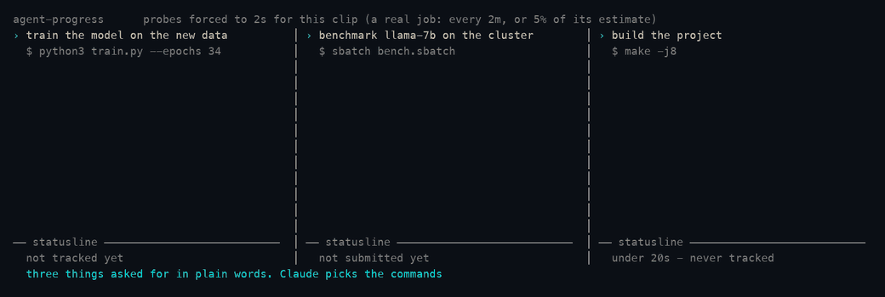

<h1 align="center">agent-progress</h1>
<p align="center">tqdm-style progress bars in the Claude Code statusline, for any long-running job.</p>

<p align="center">
  <a href="#install">install</a> •
  <a href="#what-counts-as-progress">monitors</a> •
  <a href="#when-a-job-crashes">crashes</a> •
  <a href="#configuration">configuration</a>
</p>

<p align="center">
  
  
  
</p>

<p align="center">
  
</p>

<p align="center">
  <i>Three things asked for in plain words, the commands Claude chose, what it said back,<br>
  and the bars. One line when a job starts, one when it ends, nothing in between —<br>
  except the benchmark, which died, and got explained.<br>
  Full recording: <a href="demo/agent-progress.mov">demo/agent-progress.mov</a></i>
</p>

## Why

A progress bar needs two things most long jobs never give you: a way to observe
progress, and a total to measure it against.

Most scripts don't print `Epoch 3/50`. Some narrate stages, some just write
files, some are silent for an hour. And at second zero nothing knows how long
the run will take.

`agent-progress` puts a model in the loop for exactly the part that needs judgement —
deciding *what to watch* and *roughly how long this will take* — then gets out of
the way. Claude sets it up once. After that a detached watcher does the
observing, and the ETA corrects itself from measured throughput.

| signal | where it comes from | when it dominates |
| --- | --- | --- |
| **prior** | Claude reads the script, past run logs, output mtimes, `nvidia-smi` | the first minute |
| **measured** | a watcher observes the job and computes real throughput | once ~6 observations exist |

A `~` before the remaining time means the estimate is still partly a guess.
Claude burns no tokens while the job runs.

---

## Install

Requires Claude Code and Python 3.8+. No third-party dependencies.

```bash
git clone https://github.com/csinva/agent-progress ~/.claude/skills/agent-progress
~/.claude/skills/agent-progress/scripts/install-statusline.sh
```

Claude Code auto-loads anything in `~/.claude/skills/` as a plugin. The install
script wires the statusline and puts `agent-progress` on your `PATH`; it backs up
`~/.claude/settings.json` first, and `--uninstall` reverts it. Restart Claude
Code afterwards.

### Installing into sessions that are already open

`/reload-plugins` activates the skills and hooks in a running session, and
tracking starts working there immediately — jobs are caught, bars are drawn into
the state file, `agent-progress ls` and the completion notification behave normally.

The one thing it cannot do is show the bar. A session reads its statusline
setting once, when it starts, so a session that was already open has no place to
draw one however it is reloaded. Restart Claude Code for that. A job tracked
from such a session says so when it starts rather than leaving you wondering
where the bar went, and `agent-progress doctor` will tell you which kind of session
you are in.

When no job is running the statusline falls back to `⏺ model · dir · branch`, so
you lose nothing.

---

## See it in action

The clip above is one real session with three commands running side by side,
recorded frame by frame from live job state through the same renderer the
statusline uses. The commands go through the actual hook. Waiting is compressed
by capturing fewer frames per second of real time, with the multiplier shown on
screen — so the twenty-second threshold in the clip really is twenty seconds.

Left to right: a training run that waits out the threshold and is then tracked;
a benchmark submitted to a scheduler with `sbatch`, which is tracked from the
moment it is queued and dies out of memory once it starts; and a build that
finishes in four seconds and is never tracked at all.

Two things are staged. The probe cadence is forced to two seconds so the bars
visibly move over a job lasting a minute — the header says so on screen. And the
machine this is recorded on has no cluster attached, so `sbatch`, `scontrol` and
`sacct` are stubs in `demo/record.py` that answer the way slurm would. Everything
on this side of them is real: the real hook rewrites the command, the real
submission detector reads the job id out of what `sbatch` printed, and the real
watcher asks the real questions and draws the bar from the answers.

Regenerate it with `python3 demo/record.py`; encoding uses AVFoundation, so no
ffmpeg is needed.

For the full thing, including every monitor kind, run it yourself:

```bash
agent-progress demo --tour
```

Seven real jobs — one per monitor kind, plus one that crashes and one too short
to display — with narration about what to look for, in the terminal and in your
statusline. Takes about a minute and cleans up after itself.

```
agent-progress tour  +24s

  ⠹ demo-train   ▕████████████████▌·····▏  75%  18/24ep    00:26<00:08  1.4s/ep    est 34s (+9s)
  ⠹ demo-shards  ▕████████████████▌·····▏  75%  9/12file   00:26<00:08  2.7s/file  est 34s (-15s)
  ⠹ demo-index   ▕█████████████████▉····▏  81%             00:26<00:06             est 32s (-17s)
  ⠹ demo-etl     ▕█████████████████▌····▏  80%  4/5stage   00:26<~00:15 6.7s/stage
  ⠹ demo-queue   ▕███████████████▍······▏  70%  28/40row   00:26<00:11  1.08row/s  est 37s (-12s)
  💀 demo-flaky  ▕███████████▌··········▏  52%             in 00:08     exit 1
  ✓ demo-quickie ▕██████████████████████▏ 100%             in 00:11

  -> demo-train was given a deliberately wrong 25s estimate. It is measuring its
     own throughput now - watch the ETA move.
```

It ends by printing the crash report Claude receives, and the statusline view of
the same jobs — filtered to 3 rows with the short job dropped — next to the full
list, so the difference is visible.

`agent-progress demo` is the quick one-job version. `--speed 2` runs the tour twice
as fast.

---

## Use it

Through Claude — say *"run this in the background and show me a progress bar"*,
or:

```
/agent-progress:track python pipeline.py --input raw/
/agent-progress:progress
```

Claude is told about running jobs at session start and on each prompt, so it can
volunteer *"that pipeline is 60% done, landing around 4:15pm"* unprompted.

Or drive it yourself:

```bash
agent-progress run --name ingest --eta 40m --glob 'out/*.parquet' --total 500 -- python pipeline.py
agent-progress start reindex --pid 45123 --log /var/log/reindex.log --eta 3h
agent-progress ls                    # rendered bars
agent-progress ls --json             # structured status
agent-progress log ingest -n 40      # tail the captured output
agent-progress update ingest --eta 90m --note "hit the slow shards"
agent-progress watch                 # live dashboard for a second pane
agent-progress inbox                 # crash reports
agent-progress monitors              # explain the monitor kinds
agent-progress autotrack '<cmd>'     # would this be tracked automatically?
agent-progress exec --after 20s -- <cmd>   # run it, track it only if it is slow
agent-progress preview               # see your settings rendered
agent-progress demo                  # simulated job, end to end
agent-progress doctor                # check the install
```

`run` detaches the process, captures stdout and stderr, tracks the pid, and
records the real exit code.

---

## Asking for a job in words

The ordinary way to use this is not to type a command at all:

> **run training on the new dataset**

Claude picks the command, starts it through agent-progress, and carries on. The
job is detached within seconds, so the conversation is never blocked waiting for
it, and a bar appears on your statusline.

**It stays quiet.** You asked for a job, not for a report about how it is being
watched — so there is no announcement that tracking started, no job id, no
explanation of the bar. The bar is the interface. Claude speaks up for three
things only:

- the job **crashed** — you hear immediately, with what the log says about why
- you **asked** — "how's training going?" gets a real answer
- something is **wrong** — stalled, diverging, or an estimate badly enough off
  that you would want to know

This is also why the skill tells Claude to launch such jobs through
agent-progress rather than in the foreground. A foreground training run blocks
the tool call until it finishes, which means the conversation stops for hours.

## It triggers itself, and costs nothing until it has to

You never ask for a progress bar. Long commands are caught by a `PreToolUse`
hook — but catching one is not the same as tracking it.

A caught command is wrapped so that **it runs exactly as it would have**: same
output, streamed as it appears, same exit code. If it finishes within **20
seconds**, that is the end of it. No job is created, no file is written, nothing
is said to Claude, and no tokens are spent. The overwhelming majority of
commands land here.

Only a command still running after the threshold is handed off: it keeps going
in the background, a bar appears, and Claude is told once — at which point it
can spend a moment on an estimate, because now there is something worth
estimating.

```bash
agent-progress config --set auto_track_after_seconds=60   # more patient
agent-progress config --set auto_track_after_seconds=0    # track immediately
agent-progress config --preset eager                      # same thing
```

Because a quick run now costs nothing, the detector can afford to be broad. A
command is caught when it is backgrounded, when it is given a timeout of two
minutes or more, or when it matches one of 33 patterns — training scripts,
`torchrun`, `accelerate`, `deepspeed`, sweeps, `spark-submit`, `terraform`,
`ansible`, `docker build`, `rsync`, `aws s3 sync`, model downloads, `dvc`,
`dbt`, `pg_restore`, `git clone`, and ordinary work like `pytest`, `make`,
`cargo build`, `npm test`, `go test`. Catching `pytest` is free when the suite
takes four seconds, and useful when it takes four minutes.

```bash
agent-progress autotrack 'pytest tests/'
#   TRACK        pytest tests/
#                it looks like a pytest run
#   becomes      agent-progress exec --name pytest --after 20 --shell 'pytest tests/'
#                only tracked if still running after 20s
```

### Jobs handed to a scheduler

`sbatch`, `qsub` and `bsub` return in under a second — they queue work rather
than doing it — so there is no local process to watch and nothing that would
normally notice the job ending. These are caught anyway. The submission is
recognised, the job id is read out of what the command prints, and the queued
job is tracked:

```
$ sbatch train.sbatch
Submitted batch job 4242

[agent-progress] slurm job 4242 is queued, and is being tracked as 'slurm-4242'.
Waiting for nodes.
Progress comes from slurm-4242.out once the scheduler writes it, and the job's
state comes from the scheduler itself, so its bar finishes on its own.
Do not poll it with squeue - the bar already does, and says why it waits.
```

#### Queued is a state of its own

A job in a queue is not a job making slow progress, and it is not shown as one:

```
⏳ slurm-4242 ▕······················▏ queued 41m · waiting for nodes, on gpu
⠹ slurm-4242 ▕████████▌·············▏  38%  13/34ep  00:12<00:19  57s/ep  →16:41
```

The bar is empty rather than sliding, there is no invented percentage, and the
line says how long it has waited and slurm's own reason for the wait — `Resources`,
`Priority`, `Dependency`, a QOS limit — in words.

The distinction is not cosmetic. Everything the estimate is built on is anchored
to when the job **started**, and for a scheduler job that is not when you
submitted it. A job that sat in the queue for four hours and has been running
for ten minutes is ten minutes in, not four hours and ten. When slurm reports it
started, the clock is re-anchored to slurm's own `RunTime` and the queue-time
samples — which measured nothing — are dropped. The wait is kept separately, and
`agent-progress watch` shows it.

Slurm specifically is asked with one `scontrol show job`, which answers more than
the state word: where the job landed (`NodeList`, `Partition`), how long it has
really been running, and its `TimeLimit` — used as the standing estimate until
the job has printed enough to measure, because an upper bound beats no bound. It
falls back to `sacct` once `scontrol` has forgotten the job, which is the only
thing that can still say how it went.

An **array** gets a progress bar for nothing: tasks finished out of tasks
submitted, straight from the scheduler, which is better than anything the log of
any one task could tell you.

```
⠹ slurm-90    ▕█████████████▌········▏  62%  5/8task  00:41<00:24  8.2m/task
```

A run the cluster kills comes back as a crash carrying the word the scheduler
used — `OUT_OF_MEMORY`, `TIMEOUT`, `NODE_FAIL` — rather than an invented exit
code.

To follow a job already in the queue:

```bash
agent-progress slurm 4242 --eta 6h
agent-progress slurm 4242 --interval 30s     # ask the scheduler more often
```

Any other queue works the same way if you can name a command that prints the
job's state — `COMPLETED` / `FAILED` / `RUNNING`, or a bare exit code:

```bash
agent-progress start render --eta 2h --log render.log \
  --state-probe "kubectl get job/render -o jsonpath='{.status.conditions[0].type}'"
```

### Modes

| `auto_track` | behavior |
| --- | --- |
| `defer` *(default)* | run it normally; track it only once it outlives `auto_track_after_seconds` |
| `instruct` | stop it before it starts and ask Claude to relaunch it through `agent-progress`, with an estimate and monitor chosen first |
| `off` | never intervene |

`instruct` buys a bar that is correct from the first frame, at the price of a
round-trip on every long job — including the ones that would have turned out
short. `defer` pays nothing up front and fills the estimate in afterwards.

Two more things kept cheap:

- A job handed off below the two-minute statusline floor is tracked but never
  shown, and Claude is told not to bother estimating it.
- Job status used to be re-sent to Claude on every prompt. It now goes out only
  when the picture changes — a job appears, finishes, or gains an estimate — and
  otherwise at most once per `context_min_interval_seconds` (default 5 minutes).
  Crashes are always sent immediately.

Turning it down:

```bash
agent-progress config --set auto_track=instruct            # ask before taking over
agent-progress config --set auto_track=off                 # leave everything alone
agent-progress config --set auto_track_ignore='^\./scripts/quick'
AGENT_PROGRESS_NO_AUTO=1 <command>                         # just this once
```

Nothing is ever silently allowed past a permission prompt: the rewritten command
still goes through the normal approval flow.

## What counts as progress

The interesting decision. Claude picks the signal that actually moves for a
given job:

| the job… | monitor | flags |
| --- | --- | --- |
| prints a counter or tqdm bar | `auto` *(default)* | *none* |
| prints a counter oddly | `log` | `--pattern 'done (?P<step>\d+) of (?P<total>\d+)'` |
| narrates named stages | `milestones` | `--milestones 'loading;training;evaluating;saving'` |
| writes output files | `files` | `--glob 'out/shard-*.parquet' --total 500` |
| grows a file or directory | `size` | `--path out/index.bin --target-size 12GB` |
| state lives elsewhere | `probe` | `--probe 'psql -tAc "select count(*) from rows"' --total 2000000` |
| exposes nothing | `time` | `--monitor time` |

`milestones` covers scripts that just narrate what they're doing. `probe` is the
escape hatch for state in a database, a queue, or on another host.

`auto` recognizes tqdm, HuggingFace Trainer, PyTorch Lightning (outer epoch plus
inner bar), Keras, `Epoch 12/50`, `step 900/10000`, `Trial 7 of 40`, and bare
percentages.

A job with no observable signal still gets a bar, running on wall-clock against
the estimate. A job with neither signal nor estimate renders as an indeterminate
sweep rather than inventing a number.

---

## The estimate corrects itself

Progress is re-observed **at most once every 2 minutes, and at most once per 5%
of the estimated total** — whichever is less often.

| estimated total | update interval |
| --- | --- |
| ≤ 40 min | 2 min |
| 2 hours | 6 min |
| 10 hours | 30 min |
| 3 days | 3h 36m |

The cadence stretches as the estimate grows. Completion is detected separately
by a near-free liveness check, so a job that ends is noticed within seconds
regardless. Elapsed time and the projected finish keep updating on every frame —
only the observed counter moves on the cadence.

The *total* estimate is recomputed at each observation, so a job that turns out
slower says so: `est 26m (+6m)`.

---

## When a job crashes

```
💀 trainer ▕█▍····················▏   2%  1/50ep  in 04:12  SIGKILL
```

1. **The bar turns into a skull**, within ~300ms. The exit status is decoded —
   `SIGKILL`, `SIGSEGV`, `exit 1` — not left as a bare number. Crashed jobs are
   always shown, even short ones, and linger 30 minutes.
2. **A desktop notification** fires with the reason and duration.
3. **Claude tells you, unprompted.** The crash is queued with the last 15 lines
   of output, and a `Stop` hook hands it over the moment Claude finishes its next
   turn — no waiting for you to type anything. Claude reports what died,
   summarizes the cause, and suggests a fix.

Nothing can push a message into a running Claude session from outside, so
delivery is queued rather than instantaneous: the report arrives at the first of
Claude finishing a turn, you sending a message, or a new session starting. It is
delivered exactly once and never lost. The interrupt is one-shot per crash and
guarded against stop-hook loops.

`agent-progress config --set crash_alert=false` keeps the skull and the notification
but drops the interruption. A job you `cancel` isn't a crash — it gets `■` and
stays silent.

---

## Short jobs are hidden

A job whose estimated total is under **2 minutes** never reaches the statusline;
a bar that flashes past is noise. It's still tracked, still notifies, still
records its exit code.

```bash
agent-progress config --set min_duration_seconds=0     # show everything
agent-progress config --set min_duration_seconds=600   # only jobs over 10 minutes
```

`--force-show` pins a job regardless. And a job estimated short that is *still
running* past the threshold appears anyway — an underestimate surfaces itself
rather than staying invisible.

---

## Configuration

48 settings, each with a default, a type, a valid range and a one-line
explanation:

```bash
agent-progress config                       # the whole table, * marks what you changed
agent-progress config --set bar_width=30 --set style=tqdm
agent-progress config --unset bar_width     # back to the default
agent-progress config --reset               # back to all defaults
agent-progress config --edit                # open the JSON in $EDITOR
```

Values are validated on the way in — a bad range, an invalid choice or a
misspelled key is rejected with the reason and a suggestion:

```
$ agent-progress config --set bar_widht=30
unknown setting 'bar_widht' - did you mean bar_width, name_width, note_width?
```

See changes before keeping them:

```bash
agent-progress preview                      # sample bars in every state
agent-progress preview --set style=dots     # try a setting without saving it
agent-progress preview --colors             # the 256-color codes
```

Presets bundle common combinations:

| preset | effect |
| --- | --- |
| `minimal` | bar and percentage only |
| `rich` | every field, wider bar, five jobs |
| `tqdm` | tqdm-faithful |
| `plain` | ascii, no color |
| `quiet` | only jobs over ten minutes, one at a time, no sound |
| `guided` | ask before taking a command over (`auto_track=instruct`) |
| `manual` | never take one over (`auto_track=off`) |
| `eager` | start tracking from the first second |

```bash
agent-progress config --preset minimal
```

Any setting can be overridden for one command via the environment:

```bash
AGENT_PROGRESS_BAR_WIDTH=40 AGENT_PROGRESS_STYLE=bars agent-progress ls
```

`NO_COLOR` is honored.

| group | settings |
| --- | --- |
| **visibility** | `min_duration_seconds`, `max_jobs`, `keep_done_seconds`, `keep_failed_seconds`, `prune_after_hours`, `show_context_line` |
| **cadence** | `min_interval_seconds`, `interval_fraction` |
| **bar shape** | `style`, `bar_width`, `name_width`, `fill_char`, `track_char`, `left_cap`, `right_cap`, `spinner`, `spinner_fps`, `glyph_done`, `glyph_failed`, `glyph_cancelled`, `glyph_stalled` |
| **fields** | `show_spinner`, `show_name`, `show_percent`, `show_counts`, `show_clock`, `show_rate`, `show_eta_clock`, `show_drift`, `show_note`, `note_width`, `clock_format` |
| **color** | `color`, `color_running`, `color_done`, `color_failed`, `color_warn`, `color_dim`, `color_track`, `color_text` |
| **estimation** | `blend_full_at`, `rate_window`, `rate_min_span`, `drift_threshold` |
| **behavior** | `notify`, `notify_sound_ok`, `notify_sound_fail`, `crash_alert`, `context_min_interval_seconds` |
| **auto** | `auto_track`, `auto_track_after_seconds`, `auto_track_timeout_seconds`, `auto_track_background`, `auto_track_patterns`, `auto_track_ignore` |

Styles are `blocks`, `tqdm`, `ascii`, `dots`, `bars`, and any of them can be
overridden character by character:

```bash
agent-progress config --set style=bars --set fill_char=▓ --set track_char=░
```

---

## How it fits together

```
.claude-plugin/plugin.json   plugin manifest
skills/agent-progress/SKILL.md   teaches Claude when and how to use it
commands/track.md            /agent-progress:track
commands/progress.md         /agent-progress:progress
hooks/hooks.json             PreToolUse, SessionStart, UserPromptSubmit, Stop
hooks/auto_track.py          catches long commands as they are launched
hooks/inject_status.py       job status into context; crash delivery
scripts/agent_progress.py        the engine - state, monitors, estimation, rendering
scripts/install-statusline.sh
tests/all.py                 runs every suite
tests/run_tests.py           integration: the real CLI, hooks and processes
tests/test_units.py          unit: parsing, the estimator, monitors, config
tests/test_lifecycle.py      the watcher, old state, pruning, the installer
tests/test_hooks.py          hook contracts and the statusline's shape
tests/test_robust.py         damaged state, scale, settings
tests/test_consistency.py    the declaration tables agree with the code
demo/tour.py                 the narrated tour
demo/record.py               renders the .mov and .gif from live job state
demo/mov_encoder.swift       PNG frames -> .mov via AVFoundation
```

Run the tests with `python3 tests/all.py` — 549 checks over real processes,
nothing mocked. A couple of minutes, most of it spent waiting on actual
commands, which is the only way to check a threshold or a watcher.

State lives in `~/.claude/agent-progress/` (`state.json`, `logs/`, `config.json`).
The statusline renders in ~40ms. A watcher killed by a reboot is respawned at
the next session start, so bars don't freeze. A monitor that throws never kills
the bar — the estimate carries it.

---

## License

MIT
