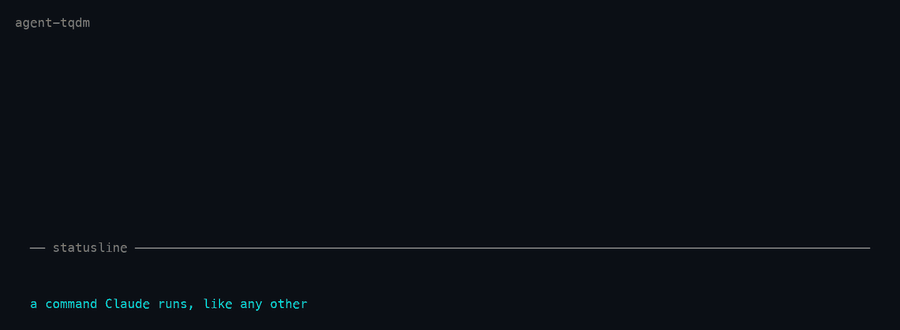

<h1 align="center">agent-tqdm</h1>
<p align="center">tqdm-style progress bars in the Claude Code statusline, for any long-running job.</p>

<p align="center">
  <a href="#install">install</a> •
  <a href="#what-counts-as-progress">monitors</a> •
  <a href="#when-a-job-crashes">crashes</a> •
  <a href="#configuration">configuration</a>
</p>

<p align="center">
  
  
  
</p>

<p align="center">
  
</p>

<p align="center">
  <i>You send the command; Claude works out how to watch it and how long it should take.<br>
  Full recording: <a href="demo/agent-tqdm.mov">demo/agent-tqdm.mov</a></i>
</p>

## Why

A progress bar needs two things most long jobs never give you: a way to observe
progress, and a total to measure it against.

Most scripts don't print `Epoch 3/50`. Some narrate stages, some just write
files, some are silent for an hour. And at second zero nothing knows how long
the run will take.

`agent-tqdm` puts a model in the loop for exactly the part that needs judgement —
deciding *what to watch* and *roughly how long this will take* — then gets out of
the way. Claude sets it up once. After that a detached watcher does the
observing, and the ETA corrects itself from measured throughput.

| signal | where it comes from | when it dominates |
| --- | --- | --- |
| **prior** | Claude reads the script, past run logs, output mtimes, `nvidia-smi` | the first minute |
| **measured** | a watcher observes the job and computes real throughput | once ~6 observations exist |

A `~` before the remaining time means the estimate is still partly a guess.
Claude burns no tokens while the job runs.

---

## Install

Requires Claude Code and Python 3.8+. No third-party dependencies.

```bash
git clone https://github.com/csinva/agent-tqdm ~/.claude/skills/agent-tqdm
~/.claude/skills/agent-tqdm/scripts/install-statusline.sh
```

Claude Code auto-loads anything in `~/.claude/skills/` as a plugin. The install
script wires the statusline and puts `agent-tqdm` on your `PATH`; it backs up
`~/.claude/settings.json` first, and `--uninstall` reverts it. Restart Claude
Code afterwards.

When no job is running the statusline falls back to `⏺ model · dir · branch`, so
you lose nothing.

---

## See it in action

The clip above is `demo/agent-tqdm.mov`, recorded from live job state — the bars
in it are real output, not a mock-up. Regenerate it with `python3 demo/record.py`:
frames render through the same code the statusline uses, and encoding goes
through AVFoundation, so no ffmpeg is needed.

For the full thing, including every monitor kind, run it yourself:

```bash
agent-tqdm demo --tour
```

Seven real jobs — one per monitor kind, plus one that crashes and one too short
to display — with narration about what to look for, in the terminal and in your
statusline. Takes about a minute and cleans up after itself.

```
agent-tqdm tour  +24s

  ⠹ demo-train   ▕████████████████▌·····▏  75%  18/24ep    00:26<00:08  1.4s/ep    est 34s (+9s)
  ⠹ demo-shards  ▕████████████████▌·····▏  75%  9/12file   00:26<00:08  2.7s/file  est 34s (-15s)
  ⠹ demo-index   ▕█████████████████▉····▏  81%             00:26<00:06             est 32s (-17s)
  ⠹ demo-etl     ▕█████████████████▌····▏  80%  4/5stage   00:26<~00:15 6.7s/stage
  ⠹ demo-queue   ▕███████████████▍······▏  70%  28/40row   00:26<00:11  1.08row/s  est 37s (-12s)
  💀 demo-flaky  ▕███████████▌··········▏  52%             in 00:08     exit 1
  ✓ demo-quickie ▕██████████████████████▏ 100%             in 00:11

  -> demo-train was given a deliberately wrong 25s estimate. It is measuring its
     own throughput now - watch the ETA move.
```

It ends by printing the crash report Claude receives, and the statusline view of
the same jobs — filtered to 3 rows with the short job dropped — next to the full
list, so the difference is visible.

`agent-tqdm demo` is the quick one-job version. `--speed 2` runs the tour twice
as fast.

---

## Use it

Through Claude — say *"run this in the background and show me a progress bar"*,
or:

```
/agent-tqdm:track python pipeline.py --input raw/
/agent-tqdm:progress
```

Claude is told about running jobs at session start and on each prompt, so it can
volunteer *"that pipeline is 60% done, landing around 4:15pm"* unprompted.

Or drive it yourself:

```bash
agent-tqdm run --name ingest --eta 40m --glob 'out/*.parquet' --total 500 -- python pipeline.py
agent-tqdm start reindex --pid 45123 --log /var/log/reindex.log --eta 3h
agent-tqdm ls                    # rendered bars
agent-tqdm ls --json             # structured status
agent-tqdm log ingest -n 40      # tail the captured output
agent-tqdm update ingest --eta 90m --note "hit the slow shards"
agent-tqdm watch                 # live dashboard for a second pane
agent-tqdm inbox                 # crash reports
agent-tqdm monitors              # explain the monitor kinds
agent-tqdm autotrack '<cmd>'     # would this be tracked automatically?
agent-tqdm preview               # see your settings rendered
agent-tqdm demo                  # simulated job, end to end
agent-tqdm doctor                # check the install
```

`run` detaches the process, captures stdout and stderr, tracks the pid, and
records the real exit code.

---

## It triggers itself

You do not have to ask for a progress bar. When a long-running command is
launched through Claude Code, a `PreToolUse` hook catches it and it gets tracked
— no slash command, no "please track this".

A command is caught when **any** of these is true:

- it was launched in the background,
- it was given a timeout of two minutes or more — whoever wrote the command has
  already said it is slow,
- it matches one of ~30 built-in patterns: training scripts, `torchrun`,
  `accelerate launch`, `deepspeed`, sweeps, `spark-submit`, `terraform apply`,
  `ansible-playbook`, `docker build`, `rsync`, `aws s3 sync`, `huggingface-cli
  download`, `dvc repro`, `dbt run`, `pg_restore`, `git clone`, and so on.

Test suites and ordinary builds — `pytest`, `npm test`, `make`, `cargo build` —
are **not** caught by default. They are quick as often as they are slow, Claude
usually wants their output in front of it, and anything under two minutes would
not earn a bar anyway. They are still caught if you background them or give them
a long timeout, and you can opt in permanently:

```bash
agent-tqdm config --set auto_track_patterns='\bpytest\b;\bmake\b;\bgo\s+test\b'
```

Check any command against the detector:

```bash
agent-tqdm autotrack 'python train.py --epochs 50'
#   TRACK        python train.py --epochs 50
#                it looks like a training or evaluation script
```

### What happens when one is caught

| `auto_track` | behavior |
| --- | --- |
| `instruct` *(default)* | the command is stopped once, and Claude is told to relaunch it through `agent-tqdm` — choosing a monitor and an estimate first |
| `wrap` | the command is rewritten silently into `agent-tqdm run …`; no round-trip, but the job starts with no estimate until Claude sets one |
| `off` | never intervene |

`instruct` costs one round-trip and buys the two things only a model can supply:
a guess at how long the job will take, and a decision about what to watch for
progress. `wrap` is instant but starts blind — Claude is prompted to fill the
estimate in afterwards.

Any given command is interrupted **at most once per session**. If Claude decides
it needs the output inline after all, it re-runs the command unchanged and it
goes straight through. Nothing is ever silently allowed past a permission
prompt: in `wrap` mode the rewritten command still goes through the normal
approval flow.

Turning it off, wholly or in part:

```bash
agent-tqdm config --set auto_track=off
agent-tqdm config --set auto_track_ignore='^\./scripts/quick'   # never catch these
AGENT_TQDM_NO_AUTO=1 <command>                                 # just this once
```

## What counts as progress

The interesting decision. Claude picks the signal that actually moves for a
given job:

| the job… | monitor | flags |
| --- | --- | --- |
| prints a counter or tqdm bar | `auto` *(default)* | *none* |
| prints a counter oddly | `log` | `--pattern 'done (?P<step>\d+) of (?P<total>\d+)'` |
| narrates named stages | `milestones` | `--milestones 'loading;training;evaluating;saving'` |
| writes output files | `files` | `--glob 'out/shard-*.parquet' --total 500` |
| grows a file or directory | `size` | `--path out/index.bin --target-size 12GB` |
| state lives elsewhere | `probe` | `--probe 'psql -tAc "select count(*) from rows"' --total 2000000` |
| exposes nothing | `time` | `--monitor time` |

`milestones` covers scripts that just narrate what they're doing. `probe` is the
escape hatch for state in a database, a queue, or on another host.

`auto` recognizes tqdm, HuggingFace Trainer, PyTorch Lightning (outer epoch plus
inner bar), Keras, `Epoch 12/50`, `step 900/10000`, `Trial 7 of 40`, and bare
percentages.

A job with no observable signal still gets a bar, running on wall-clock against
the estimate. A job with neither signal nor estimate renders as an indeterminate
sweep rather than inventing a number.

---

## The estimate corrects itself

Progress is re-observed **at most once every 2 minutes, and at most once per 5%
of the estimated total** — whichever is less often.

| estimated total | update interval |
| --- | --- |
| ≤ 40 min | 2 min |
| 2 hours | 6 min |
| 10 hours | 30 min |
| 3 days | 3h 36m |

The cadence stretches as the estimate grows. Completion is detected separately
by a near-free liveness check, so a job that ends is noticed within seconds
regardless. Elapsed time and the projected finish keep updating on every frame —
only the observed counter moves on the cadence.

The *total* estimate is recomputed at each observation, so a job that turns out
slower says so: `est 26m (+6m)`.

---

## When a job crashes

```
💀 trainer ▕█▍····················▏   2%  1/50ep  in 04:12  SIGKILL
```

1. **The bar turns into a skull**, within ~300ms. The exit status is decoded —
   `SIGKILL`, `SIGSEGV`, `exit 1` — not left as a bare number. Crashed jobs are
   always shown, even short ones, and linger 30 minutes.
2. **A desktop notification** fires with the reason and duration.
3. **Claude tells you, unprompted.** The crash is queued with the last 15 lines
   of output, and a `Stop` hook hands it over the moment Claude finishes its next
   turn — no waiting for you to type anything. Claude reports what died,
   summarizes the cause, and suggests a fix.

Nothing can push a message into a running Claude session from outside, so
delivery is queued rather than instantaneous: the report arrives at the first of
Claude finishing a turn, you sending a message, or a new session starting. It is
delivered exactly once and never lost. The interrupt is one-shot per crash and
guarded against stop-hook loops.

`agent-tqdm config --set crash_alert=false` keeps the skull and the notification
but drops the interruption. A job you `cancel` isn't a crash — it gets `■` and
stays silent.

---

## Short jobs are hidden

A job whose estimated total is under **2 minutes** never reaches the statusline;
a bar that flashes past is noise. It's still tracked, still notifies, still
records its exit code.

```bash
agent-tqdm config --set min_duration_seconds=0     # show everything
agent-tqdm config --set min_duration_seconds=600   # only jobs over 10 minutes
```

`--force-show` pins a job regardless. And a job estimated short that is *still
running* past the threshold appears anyway — an underestimate surfaces itself
rather than staying invisible.

---

## Configuration

48 settings, each with a default, a type, a valid range and a one-line
explanation:

```bash
agent-tqdm config                       # the whole table, * marks what you changed
agent-tqdm config --set bar_width=30 --set style=tqdm
agent-tqdm config --unset bar_width     # back to the default
agent-tqdm config --reset               # back to all defaults
agent-tqdm config --edit                # open the JSON in $EDITOR
```

Values are validated on the way in — a bad range, an invalid choice or a
misspelled key is rejected with the reason and a suggestion:

```
$ agent-tqdm config --set bar_widht=30
unknown setting 'bar_widht' - did you mean bar_width, name_width, note_width?
```

See changes before keeping them:

```bash
agent-tqdm preview                      # sample bars in every state
agent-tqdm preview --set style=dots     # try a setting without saving it
agent-tqdm preview --colors             # the 256-color codes
```

Presets: `minimal`, `rich`, `tqdm`, `plain`, `quiet`.

```bash
agent-tqdm config --preset minimal
```

Any setting can be overridden for one command via the environment:

```bash
AGENT_TQDM_BAR_WIDTH=40 AGENT_TQDM_STYLE=bars agent-tqdm ls
```

`NO_COLOR` is honored.

| group | settings |
| --- | --- |
| **visibility** | `min_duration_seconds`, `max_jobs`, `keep_done_seconds`, `keep_failed_seconds`, `prune_after_hours`, `show_context_line` |
| **cadence** | `min_interval_seconds`, `interval_fraction` |
| **bar shape** | `style`, `bar_width`, `name_width`, `fill_char`, `track_char`, `left_cap`, `right_cap`, `spinner`, `spinner_fps`, `glyph_done`, `glyph_failed`, `glyph_cancelled`, `glyph_stalled` |
| **fields** | `show_spinner`, `show_name`, `show_percent`, `show_counts`, `show_clock`, `show_rate`, `show_eta_clock`, `show_drift`, `show_note`, `note_width`, `clock_format` |
| **color** | `color`, `color_running`, `color_done`, `color_failed`, `color_warn`, `color_dim`, `color_track`, `color_text` |
| **estimation** | `blend_full_at`, `rate_window`, `rate_min_span`, `drift_threshold` |
| **behavior** | `notify`, `notify_sound_ok`, `notify_sound_fail`, `crash_alert` |
| **auto** | `auto_track`, `auto_track_timeout_seconds`, `auto_track_background`, `auto_track_patterns`, `auto_track_ignore` |

Styles are `blocks`, `tqdm`, `ascii`, `dots`, `bars`, and any of them can be
overridden character by character:

```bash
agent-tqdm config --set style=bars --set fill_char=▓ --set track_char=░
```

---

## How it fits together

```
.claude-plugin/plugin.json   plugin manifest
skills/agent-tqdm/SKILL.md   teaches Claude when and how to use it
commands/track.md            /agent-tqdm:track
commands/progress.md         /agent-tqdm:progress
hooks/hooks.json             PreToolUse, SessionStart, UserPromptSubmit, Stop
hooks/auto_track.py          catches long commands as they are launched
hooks/inject_status.py       job status into context; crash delivery
scripts/agent_tqdm.py        the engine - state, monitors, estimation, rendering
scripts/install-statusline.sh
demo/tour.py                 the narrated tour
demo/record.py               renders the .mov and .gif from live job state
demo/mov_encoder.swift       PNG frames -> .mov via AVFoundation
```

State lives in `~/.claude/agent-tqdm/` (`state.json`, `logs/`, `config.json`).
The statusline renders in ~40ms. A watcher killed by a reboot is respawned at
the next session start, so bars don't freeze. A monitor that throws never kills
the bar — the estimate carries it.

---

## License

MIT
